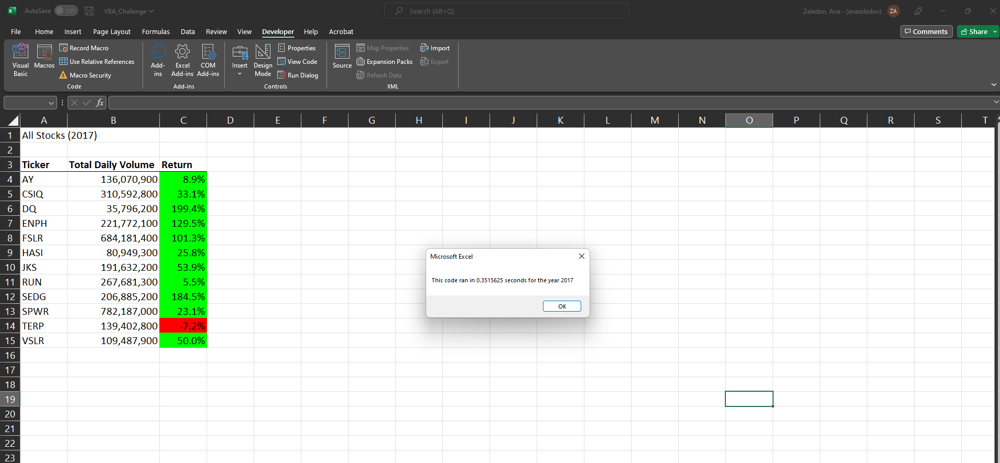
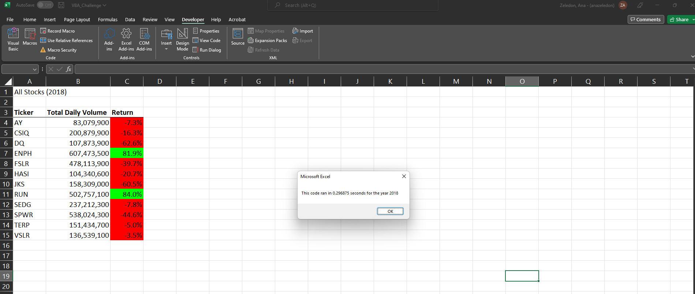

# Stock Analysis

*Performing analysis on stock data to uncover daily volume and yearly return s.*

## VBA_Challenge

### Overview of Project

*Analysis of green energy stocks and comparison between total daily volume and yearly return for each stock.*

*Refactor VBA code and measure performance*

### Purpose

*Refactoring the VBA code using green_stocks VBA code, with the goal of making a code easy to reuse for my client*

***

### Results

***

### Summay

- The advantage of refactoring a code is to improve efficiency, making a code faster and easier to read. However, one could need more information in order to nun a new code, which could be time consuming.

- Refactoring the original VBS script helped to decrease the running time for 2017 and 2018.  
